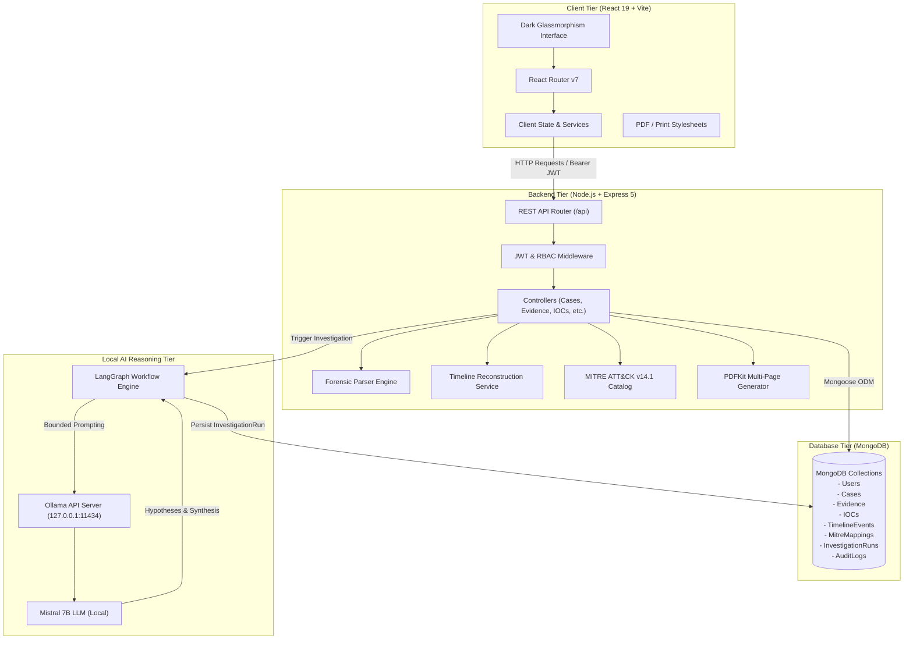
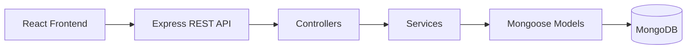

# TRACE AI — Digital Forensics & Incident Response (DFIR) Platform

[](https://nodejs.org/)
[](https://react.dev/)
[](https://expressjs.com/)
[](https://www.mongodb.com/)
[](https://langchain-ai.github.io/langgraphjs/)
[](https://ollama.com/)
[](#)

---

## 1. Project Overview

**TRACE AI** is an enterprise-grade Digital Forensics and Incident Response (DFIR) web platform designed to streamline, accelerate, and audit digital forensic investigations. Digital investigations often involve heterogeneous log files, system dumps, and alert feeds distributed across diverse systems. Investigating security incidents manually by switching between command-line utilities, text editors, and static spreadsheets leads to fragmented evidence, delayed containment, and fragile chain of custody.

TRACE AI addresses these challenges by providing a centralized operational workspace where digital forensics analysts and incident response teams can:
- Ingest forensic evidence artifacts (files and directories) with immediate cryptographic hashing.
- Deterministically parse security logs and structured records to extract critical artifacts.
- Automatically identify and deduplicate Indicators of Compromise (IOCs).
- Correlate events across multiple evidence files into a unified chronological investigation timeline.
- Map observed adversary behaviors against a verified local MITRE ATT&CK&reg; Enterprise catalog.
- Execute local, bounded AI investigations using LangGraph and Ollama (Mistral) to synthesize hypotheses and identify investigation gaps.
- Maintain immutable, comprehensive audit trails covering every user action and data mutation.
- Generate multi-page, publication-quality PDF incident reports for stakeholders and legal sign-off.

> **CRITICAL FORENSIC DISTINCTION:**  
> AI outputs generated within TRACE AI are strictly designed as **investigative decision-support aids**. They do not constitute automated forensic conclusions, final incident attribution, or certified legal evidence. Human forensic examiners and incident responders retain final authority, verification responsibility, and oversight across all investigative judgments.

---

## 2. Problem Statement

Modern security operations centers (SOC) and forensic consulting units face acute workflow bottlenecks during active incident response:

1. **Scattered Evidence Sources**: Host logs, network events, authentication traces, and system exports reside across isolated servers, hindering rapid triage.
2. **Manual and Error-Prone Workflows**: Analysts frequently rely on ad-hoc regex queries, manual grep/awk commands, or spreadsheet formulas that fail on malformed logs or subtle syntax variations.
3. **Event Correlation Deficits**: Correlating an authentication anomaly on one server with a privilege escalation command on another requires labor-intensive manual timestamp reconciliation.
4. **IOC Identification Gaps**: Malicious IP addresses, suspicious domains, credential accounts, and file hashes buried within hundreds of thousands of benign records are easy to overlook.
5. **Timeline Fragmentation**: Disparate timestamp formats (ISO-8601, Syslog format, epoch milliseconds) make manual timeline reconstruction exceptionally tedious and susceptible to chronology errors.
6. **Compromised Chain of Custody & Provenance**: Evidence files transferred across ad-hoc shares without immediate cryptographic verification risk tampering claims or integrity challenges.
7. **Laborious Report Compilation**: Authoring forensic reports under tight compliance deadlines consumes critical analyst hours that should be spent on containment and remediation.
8. **Lack of Auditable Operations**: Without centralized operational telemetry, proving who accessed evidence, triggered AI models, or altered case classifications is difficult.

---

## 3. Project Objectives

TRACE AI was engineered to achieve the following concrete technical objectives:

- **Centralized Case Management**: Provide an isolated workspace per incident with metadata tracking (severity, incident type, status, target hosts, source/destination IPs, assigned investigators).
- **Secure Evidence Ingestion**: Accept multi-file and directory uploads while recording immediate SHA-256 digests, file sizes, mime types, and custody notes.
- **Deterministic Evidence Parsing**: Parse common forensic file types without external internet dependencies using high-throughput streaming parsers.
- **Automated Artifact & IOC Detection**: Detect, normalize, deduplicate, and score threat indicators (IPs, domains, URLs, hashes, emails, usernames, event IDs) linked to originating evidence records.
- **Forensic Timeline Reconstruction**: Extract, normalize, and sort timestamps into a single, cohesive chronology with bidirectional linking between events and evidence sources.
- **Adversary Behavior Mapping (MITRE ATT&CK)**: Correlate extracted indicators and event patterns against curated Enterprise ATT&CK techniques with candidate/confirmed/rejected lifecycle controls.
- **AI-Assisted Investigation Reasoning**: Orchestrate multi-stage reasoning workflows via LangGraph and local Ollama Mistral LLMs, enforcing size budgets and prompt enclosure.
- **Comprehensive Auditability**: Maintain an append-only, searchable audit log capturing system events, user clearances, and forensic queries.
- **Stakeholder-Ready PDF Reporting**: Produce formatted, multi-page PDF documents incorporating case telemetry, cryptographic hashes, IOC tables, timeline excerpts, and investigator sign-offs.
- **Enterprise Dark/Glassmorphism UI**: Deliver a responsive, high-contrast, dark-mode cybersecurity user interface engineered for operational clarity during intensive investigations.

---

## 4. Key Features

### Authentication & Authorization
- **Operator Registration**: Form with client- and server-side password complexity enforcement.
- **Cryptographic Email Verification**: Single-use tokens with 60-second anti-spam rate limiting and console link fallback.
- **Session Authentication**: JWT access token paired with secure refresh token rotation.
- **Google SSO**: Cryptographically validated Google ID-tokens integrated into the identity subsystem.
- **Self-Service Password Recovery**: Secure, hashed, 1-hour single-use reset tokens with account enumeration defenses.
- **Role-Based Access Control (RBAC)**: Enforced across client routes and server API controllers (`Super Admin`, `Admin`, `Investigator`, `Analyst`).
- **Protected Route Guards**: Automatic validation of clearance level, JWT expiration, and token presence.

### Case Management
- **Lifecycle Case Tracking**: Manage cases across statuses (`Active`, `Under Investigation`, `Contained`, `Resolved`, `Closed`).
- **Severity Stratification**: Granular risk levels (`Low`, `Medium`, `High`, `Critical`).
- **Incident Categorization**: Classification by attack taxonomy (e.g., Unauthorized Access, Ransomware, Data Exfiltration, Phishing, Malware).
- **Case-Specific Workspaces**: Dedicated investigation panels isolating evidence, IOCs, timelines, ATT&CK matrices, and AI runs per incident.

### Evidence Management
- **Single & Multi-File Ingestion**: Upload individual files or entire directory trees through custom drag-and-drop zones.
- **Immediate SHA-256 Hashing**: Instant streaming cryptographic digest calculation upon arrival.
- **Tamper & Integrity Verification**: On-demand integrity re-checking comparing current file bytes to recorded hashes.
- **Chain of Custody Tracking**: Complete audit trails of file submitters, upload timestamps, file paths, and examiner notes.
- **Evidence Provenance**: Bidirectional linking of every parsed record, indicator, and timeline event back to its originating evidence artifact ID.

### Evidence Parsing
TRACE AI features a modular, streaming forensic parser engine.

**Supported Deterministic Formats:**
- **`TXT`**: Raw text logs and security transcripts.
- **`LOG`**: Standard daemon and application logs.
- **`SYSLOG`**: RFC-compliant and BSD-style Unix/Linux system logs.
- **`JSON`**: Structured security event streams and SIEM exports.
- **`JSONL / NDJSON`**: Newline-delimited JSON data feeds.
- **`CSV`**: Tabular event logs with automatic header and delimiter extraction.

**Explicitly Unsupported Binary Forensic Formats:**
- **`PCAP`**, **`RAW`**, **`EVTX`**, **`DMP`**: These formats are ingested, cryptographically hashed, and recorded in evidence custody. However, because specialized binary parsing for these formats is not implemented in this version, the platform transparently labels them with status `Unsupported` and alerts the investigator rather than fabricating mock data.

**Extracted Artifact Types:**
- Timestamps (ISO-8601, Syslog format, standard human-readable formats)
- IPv4 Addresses (filtered against private masks and broadcast ranges)
- Fully Qualified Domains (FQDNs)
- URLs (HTTP/HTTPS protocols)
- Email Addresses
- Cryptographic Hashes (MD5, SHA-1, SHA-256)
- Usernames & Account Identifiers
- Hostnames & Computer Names
- Process Names & Command Lines (`.exe`, system binaries)
- Security Event IDs (e.g., Windows/Syslog event codes)

### IOC Detection
- **Normalization & Sanitization**: Standardizes casing, removes trailing punctuation, and filters loopback addresses (`127.0.0.1`, `0.0.0.0`) and benign hostnames.
- **Automated Deduplication**: Consolidates identical indicators extracted across dozens of files into single records.
- **Confidence & Severity Scoring**: Assigns severity ratings (`Low`, `Medium`, `High`, `Critical`) and confidence metrics based on source context.
- **Evidence Cross-Referencing**: Preserves exact file names, record numbers, and timestamps where each IOC was discovered.

### Forensic Timeline
- **Normalized Timestamp Extraction**: Unifies diverse timestamp syntax into coordinated UTC ISO strings.
- **Chronological Sequencing**: Sorts events across multiple evidence files into a synchronized chronological stream.
- **Event Clustering & Deduplication**: Groups related events to highlight attack progression.
- **Direct IOC Correlation**: Highlights presence of known malicious indicators within timeline entries.

### MITRE ATT&CK Framework
- **Verified Enterprise Catalog**: Ships with a curated, local MITRE ATT&CK v14.1 Enterprise Matrix catalog (no internet connection needed).
- **Candidate Identification**: Suggests technique candidates based on extracted indicators, commands, and parsed log events.
- **Analyst Validation Lifecycle**: Allows investigators to review suggested mappings and transition them between `candidate`, `confirmed`, and `rejected` states.
- **Evidence Provenance**: Maps confirmed techniques directly to supporting evidence IDs.

### AI Investigation Engine
- **LangGraph Multi-Stage Orchestration**: Bounded, deterministic execution graph controlling LLM reasoning.
- **Local Ollama Integration**: Communicates locally with `mistral:latest` via HTTP API (no cloud telemetry or third-party data leakage).
- **Structured Investigation Workflow**:
  1. *Context Assembly*: Queries case evidence, IOCs, timeline events, and ATT&CK mappings within strict token budgets.
  2. *Sanitization & Enclosure*: Redacts detected credential patterns and encloses raw evidence in untrusted data boundaries.
  3. *Hypothesis Formulation*: Prompts the model to hypothesize attack vectors linked to verified evidence IDs.
  4. *Evidence Validation*: Strictly validates generated hypotheses against existing evidence IDs, purging hallucinated references.
  5. *Synthesis*: Compiles an executive narrative, identifies visibility blindspots, and outlines recommended actions.
- **InvestigationRun Persistence**: Saves complete run artifacts in MongoDB, including duration, model version, and reasoning output.
- **Audit Logging**: Logs every AI run initiation and completion in the system audit trail.

### Reports & PDF Export
- **Automated Report Assembly**: Aggregates case metadata, evidence digests, IOC findings, timeline logs, MITRE mappings, and AI summaries.
- **Dedicated PDF Generation**: High-resolution, multi-page PDF output generated using PDFKit.
- **Print Layout**: Clean CSS print stylesheets that suppress application chrome (sidebars, navigation headers, action buttons) during browser-initiated printing.
- **Examiner Sign-Off**: Formatted fields for lead investigator name, contact email, generation timestamp, and signature lines.

---

## 5. End-to-End Investigation Workflow

```
┌─────────────────┐
│   User Login    │  (JWT + RBAC Clearance)
└────────┬────────┘
         │
         ▼
┌─────────────────┐
│   Create Case   │  (Case ID, Severity, Incident Type, Target Scope)
└────────┬────────┘
         │
         ▼
┌─────────────────┐
│ Upload Evidence │  (Drag & drop single/multi-file or folder)
└────────┬────────┘
         │
         ▼
┌─────────────────┐
│ SHA-256 Digest  │  (Cryptographic hash recorded; Chain of custody established)
└────────┬────────┘
         │
         ▼
┌─────────────────┐
│ Evidence Parser │  (Deterministic parsing: TXT, LOG, SYSLOG, JSON, CSV)
└────────┬────────┘  (Unsupported formats: PCAP, RAW, EVTX, DMP flagged)
         │
         ▼
┌─────────────────┐
│  IOC Detection  │  (Extract, normalize, deduplicate IPs, domains, hashes)
└────────┬────────┘
         │
         ▼
┌─────────────────┐
│Timeline Engine  │  (Extract timestamps, build chronological event sequence)
└────────┬────────┘
         │
         ▼
┌─────────────────┐
│  MITRE ATT&CK   │  (Map against local v14.1 catalog; analyst confirms/rejects)
└────────┬────────┘
         │
         ▼
┌─────────────────┐
│ AI Reasoning    │  (LangGraph + Ollama Mistral multi-stage bounded analysis)
└────────┬────────┘
         │
         ▼
┌─────────────────┐
│InvestigationRun │  (Persist hypotheses, executive narrative, blindspots)
└────────┬────────┘
         │
         ▼
┌─────────────────┐
│  Audit Logging  │  (Record investigation telemetry in immutable audit collection)
└────────┬────────┘
         │
         ▼
┌─────────────────┐
│ Generate Report │  (Compile findings into multi-page PDF with sign-off block)
└─────────────────┘
```

### Stage Summary
1. **User Login**: Operator authenticates via email/password or Google SSO; RBAC permissions are assigned.
2. **Case Creation**: Investigator establishes a case workspace, setting incident severity and target parameters.
3. **Evidence Ingestion**: Upload forensic artifacts; system captures size, mime type, and submission timestamp.
4. **Integrity Confirmation**: Real-time SHA-256 calculation produces the cryptographic identity of each file.
5. **Deterministic Parsing**: Modular parsers extract structured records and raw forensic text lines.
6. **Indicator Mining**: Regex and structural extractors harvest IPs, hashes, usernames, domains, and event IDs.
7. **Timeline Sequencing**: Temporal engines parse timestamps and sort events across sources into a unified timeline.
8. **ATT&CK Correlation**: Rules correlate detected indicators with Enterprise tactics and techniques for analyst review.
9. **AI-Assisted Investigation**: LangGraph workflow coordinates prompt construction, hypothesis validation, and executive summarization using local Mistral.
10. **Persistence & Auditing**: Investigation artifacts are saved to MongoDB and logged in the append-only audit trail.
11. **Report Export**: Complete case file compiles into a publication-grade PDF report.

---

## 6. System Architecture



### Component Communication
- **Client to Backend**: The React 19 single-page application communicates with Express 5 REST endpoints using JSON payloads and multipart/form-data for file uploads, authenticated via `Authorization: Bearer <JWT>` headers.
- **Backend to Database**: Express services interface with MongoDB using Mongoose schemas with indexed case identifiers (`caseId`) to maintain data isolation.
- **Backend to Local AI**: The investigation workflow communicates over HTTP with a locally hosted Ollama service (`http://127.0.0.1:11434`). Raw log data is bounded, redacted, and formatted before transmission. All processing stays strictly on the local machine.

---

## Frontend → Backend → Database Flow

TRACE AI follows a decoupled, layered architectural request flow:



### Layered Request Lifecycle
1. **React Frontend**: The client interface initiates asynchronous HTTP requests via native `fetch` service modules. When accessing protected endpoints, it attaches the JWT access token in the `Authorization: Bearer <token>` header.
2. **Express REST API (`/api/*`)**: The Express routing layer receives the HTTP request and executes middleware pipelines in sequence:
   - Security headers enforcement via `helmet`
   - Cross-Origin Resource Sharing verification via `cors`
   - Tiered rate limiting via `express-rate-limit`
   - JSON / URL-encoded body parsing
   - Authentication & RBAC clearance verification via `authenticate` and `authorizeRoles`
   - Payload schema validation via `express-validator`
3. **Controllers (`server/src/controllers/`)**: Parse HTTP parameters, validate request boundaries, and orchestrate calls to underlying services. Controllers never execute low-level database queries or business algorithms directly; they format and return standardized JSON responses or pass errors to `errorHandler.js`.
4. **Services (`server/src/services/`)**: Encapsulate the core business logic of the platform, including streaming file hashing, deterministic forensic parsing, IOC detection regexes, timeline sequencing, MITRE ATT&CK correlation, LangGraph AI graph execution, and PDF report assembly.
5. **Mongoose Models (`server/src/models/`)**: Define strict data schemas, field types, validation constraints, default values, and index specifications for MongoDB collections.
6. **MongoDB Database (`arclight_dfir`)**: Provides persistent, high-throughput document storage for all operational and forensic data, executing indexed queries scoped by `caseId`.

---

## Backend Architecture

TRACE AI employs a modern **Node.js** (v18+) runtime paired with the **Express 5** framework to deliver a modular, asynchronous, and secure RESTful backend.

### Backend Responsibilities

The backend server coordinates the entire digital investigation lifecycle:

- **REST API Routing**: Exposes structured, version-controlled HTTP endpoints under `/api/*`.
- **Authentication & Authorization**: Manages operator registration, cryptographic email verification tokens, login credential validation, and Google OAuth SSO clearance.
- **Token Management**: Issues and validates cryptographically signed JWT access tokens and manages refresh token lifecycles.
- **User & RBAC Clearance**: Enforces fine-grained role-based permissions (`Super Admin`, `Admin`, `Investigator`, `Analyst`) across sensitive endpoints.
- **Case Management**: Manages case lifecycles (`Active`, `Under Investigation`, `Contained`, `Resolved`, `Closed`), incident classification, severity ratings, and investigation parameters.
- **Evidence Ingestion**: Handles single-file, multi-file, and directory uploads through streaming multipart form-data parsers with disk storage bounds.
- **SHA-256 Hashing & Integrity Verification**: Calculates streaming cryptographic digests upon receipt and provides on-demand hash re-verification against evidence records.
- **Evidence Parsing**: Coordinates high-performance deterministic streaming parsers for forensic log formats (`TXT`, `LOG`, `SYSLOG`, `JSON`, `JSONL`, `CSV`) while safely flagging unsupported binary formats.
- **IOC Detection & Normalization**: Harvests threat indicators (IPs, domains, URLs, hashes, emails, usernames) from parsed records, deduplicates matches, and calculates confidence scores.
- **Forensic Timeline Generation**: Extracts disparate timestamp formats, normalizes them to coordinated UTC ISO strings, and constructs chronological event sequences.
- **MITRE ATT&CK Mapping**: Correlates observed behaviors against the local Enterprise ATT&CK v14.1 catalog and manages the analyst validation lifecycle (`candidate`, `confirmed`, `rejected`).
- **AI Investigation Orchestration**: Directs multi-stage reasoning workflows via LangGraph state graphs and coordinates local inference with Ollama Mistral under strict token budgets.
- **Operational Audit Logging**: Writes immutable audit records tracking all authentication events, clearance modifications, evidence uploads, and report downloads.
- **Report & PDF Generation**: Compiles case telemetry, cryptographic evidence lists, IOC tables, and AI narratives into formatted, multi-page PDF documents using PDFKit.

### Backend Request Flow

All backend interactions adhere to a unidirectional layered flow:

```
React Frontend
      ↓  (HTTP REST Request / Bearer JWT)
Express REST API (Routes & Middleware)
      ↓  (Validated Request Data)
Controllers (Request Coordination)
      ↓  (Domain Operations)
Services (Forensics, LangGraph, Parsers, PDF)
      ↓  (Schema Operations)
Mongoose Models (Validation & Mapping)
      ↓  (BSON Queries / Persistence)
MongoDB (Local Database)
```

### Backend Directory Structure

Inspecting `server/src/` reflects the layered separation of concerns:

```
server/
└── src/
    ├── config/          # Environment configuration, database connection, Firebase Admin, and Multer upload limits
    ├── controllers/     # HTTP request coordinators (auth, cases, evidence, ioc, timeline, mitre, ai, reports, audit, user)
    ├── middleware/      # JWT authentication, RBAC clearance, request logging, centralized error handling, and input validation
    ├── models/          # Mongoose document schemas (User, Case, Evidence, IOC, TimelineEvent, MitreMapping, InvestigationRun, AuditLog, Report)
    ├── routes/          # Express route definitions mapping HTTP paths to controllers
    ├── services/        # Specialized domain services (forensicParser, timeline, iocDetection, mitreCatalog, investigationWorkflow, ollama, reportGenerator, socket)
    ├── scratch/         # Automated test suites and verification scripts
    ├── utils/           # Database seeding, helper utilities, and formatting helpers
    ├── validators/      # Express-validator schema rules for request payloads
    ├── app.js           # Express application configuration, middleware mounting, and route registration
    └── server.js        # Entry point: database connection bootstrapping, HTTP listener startup, and WebSocket initialization
```

---

## Backend API

The platform exposes dedicated REST route groups mounted in `server/src/app.js`. Each group encapsulates a specific functional domain:

### Primary Route Groups

| Route Group | Base Path | Core Responsibilities |
|---|---|---|
| **Authentication** | `/api/auth` | User registration, email verification (`/verify-email`), verification resend, login credential checking, Google SSO (`/google`), forgot/reset password tokens, logout, and authenticated operator profile retrieval (`/profile`). |
| **Cases** | `/api/cases` | Full CRUD operations for incident cases, plus case-scoped forensic actions: triggering IOC detection (`/:caseId/ioc/detect`), generating timelines (`/:caseId/timeline/generate`), mapping MITRE ATT&CK techniques (`/:caseId/mitre/generate`), and launching AI investigations (`/:caseId/ai/investigate`). |
| **Evidence** | `/api/evidence` | Ingestion of files and folders via multipart form-data (`/upload`), batch-level querying (`/batch/:batchId`), case-specific evidence listing (`/case/:caseId`), on-demand SHA-256 integrity verification, evidence metadata updates, and artifact file downloads. |
| **Reports** | `/api/reports` | Report compilation from active case state (`/generate`), global report archival listing, single report JSON retrieval, binary PDF report streaming (`/:id/download`), and report deletion. |
| **Audit Logs** | `/api/audit` | Querying the immutable system audit trail with filtering by actor, action type, target resource, and date range (`/`), as well as multi-format exporting (`/export` supporting CSV and JSON formats). |

### Additional Supporting Route Groups

- **Dashboard (`/api/dashboard`)**: Aggregates high-level telemetry, including active case counts, severity distributions, total ingested artifacts, and recent operational activity.
- **Timeline (`/api/timeline`)**: Global and case-scoped querying of normalized chronological forensic events and statistical distributions.
- **IOCs (`/api/ioc`)**: Standalone querying, filtering, and statistical analysis of detected Indicators of Compromise across cases.
- **MITRE ATT&CK (`/api/mitre`)**: Technique candidate inspection, status updates (`confirmed`/`rejected`), and query access to the local Enterprise catalog.
- **AI Engine (`/api/ai`)**: Manages and queries historical LangGraph investigation runs and execution statuses.
- **User Management (`/api/users`)**: Administrator endpoints for viewing operator accounts, updating clearance roles, and managing platform access.
- **Notifications (`/api/notifications`)**: Real-time user alert dispatching and notification acknowledgment.
- **Settings (`/api/settings`)**: Platform-wide configuration and investigator preferences.

---

## Database Architecture

TRACE AI relies on **MongoDB** as its primary persistent document store, interfaced through the **Mongoose 8** Object Data Modeling (ODM) library.

### What GitHub Stores vs. What MongoDB Stores

To maintain security, privacy, and forensic hygiene, code storage is strictly decoupled from runtime investigation data:

```
┌────────────────────────────────────────────────────────┐
│               GitHub Repository (Version Control)      │
│  • Application Source Code (React, Express, LangGraph) │
│  • Configuration Templates (.env.example)              │
│  • Architecture Guides & Technical Documentation       │
│  • Dependency Manifests (package.json, lockfiles)      │
└────────────────────────────────────────────────────────┘
                           ≠  (NEVER COMMITTED)
┌────────────────────────────────────────────────────────┐
│               Local MongoDB Database (Runtime Storage) │
│  • User Credentials & Clearance Roles                  │
│  • Incident Cases & Metadata                           │
│  • Forensic Evidence Records & SHA-256 Hashes          │
│  • Extracted IOCs & Forensic Timelines                 │
│  • MITRE ATT&CK Correlations & Analyst Reviews         │
│  • AI Investigation Reasoning Runs & Narratives        │
│  • Immutable Operational Audit Trail Logs              │
│  • Generated Report Document Records                   │
└────────────────────────────────────────────────────────┘
```

- **GitHub does NOT store your database**: Cloning the repository downloads the codebase and dependencies, but zero cases, zero user accounts, and zero evidence records.
- **MongoDB stores ALL application runtime data**: All investigative assets and user credentials reside exclusively within the local host's MongoDB data directory.

### Implemented Database Models (Mongoose Schemas)

The database schema is defined in `server/src/models/` and maps directly to the following collections:

1. **`User` (`server/src/models/User.js`)**: Operator accounts, email addresses, bcrypt-hashed passwords, assigned RBAC roles, email verification status, and hashed single-use reset tokens.
2. **`Case` (`server/src/models/Case.js`)**: Incident cases with unique identifiers, title, description, incident classification (e.g. Unauthorized Access), severity (`Low`, `Medium`, `High`, `Critical`), investigation status, target host, source/destination IPs, and assigned investigator IDs.
3. **`Evidence` (`server/src/models/Evidence.js`)**: Ingested forensic files with original filename, storage filepath, MIME type, file size, streaming SHA-256 digest, parser status (`Uploaded`, `Processing`, `Parsed`, `Unsupported`, `Failed`), parser type, extracted artifact counts, and chain of custody metadata.
4. **`IOC` (`server/src/models/IOC.js`)**: Threat indicators with normalized values, indicator type (`ip`, `domain`, `url`, `email`, `hash_md5`, `hash_sha1`, `hash_sha256`, `user`, `host`, `process`, `event_id`), severity rating, confidence scores, and provenance references to originating evidence files.
5. **`TimelineEvent` (`server/src/models/TimelineEvent.js`)**: Normalized chronological events with ISO-8601 timestamps, event classification, title, summary, detailed description, source evidence IDs, and associated IOC IDs.
6. **`MitreMapping` (`server/src/models/MitreMapping.js`)**: Mapped adversary behaviors containing technique ID, technique name, tactic ID, tactic name, confidence score, analyst review status (`candidate`, `confirmed`, `rejected`), rationale, and supporting evidence references.
7. **`InvestigationRun` (`server/src/models/InvestigationRun.js`)**: Records of LangGraph reasoning executions, including execution run ID, LLM model identifier (`mistral:latest`), execution duration, candidate hypotheses with supporting evidence IDs, executive summary, identified visibility gaps, and recommended actions.
8. **`AuditLog` (`server/src/models/AuditLog.js`)**: Append-only audit records containing timestamps, action names, actor IDs, operator emails, clearance roles, target resources, client IP addresses, user agents, and execution outcomes.
9. **`Report` (`server/src/models/Report.js`)**: Generated case reports storing compiled case metrics, executive summaries, risk scores, PDF file disk paths, examiner sign-offs, and creation timestamps.
10. **`Notification` (`server/src/models/Notification.js`)**: In-app user notifications and system alerts.
11. **`Settings` (`server/src/models/Settings.js`)**: Platform-wide configuration flags and preferences.

---

## MongoDB Connection

### Development Connection Configuration

The backend connects to MongoDB using the connection URI defined in `server/.env`:

```env
MONGO_URI=mongodb://127.0.0.1:27017/arclight_dfir
```

### Connection Characteristics
- **Community Server**: Relies on a standard local MongoDB Community Server installation listening on default port `27017`.
- **Mongoose Initialization**: Managed by `server/src/config/database.js` using `mongoose.connect(mongoUri, { serverSelectionTimeoutMS: 5000 })`. If MongoDB is not running, the server fails fast with clear, actionable diagnostic instructions.
- **Automatic Database Creation**: If the database `arclight_dfir` does not exist when the backend first connects, MongoDB automatically creates it when the first document is written.
- **Authentication**: Local development configurations do not require a database username or password. If connecting to a secured or remote MongoDB instance, credentials can be supplied safely via the URI without modifying application code.
- **Data Isolation**: All collections and physical data files reside on the local machine's disk drive (e.g., `C:\Program Files\MongoDB\Server\7.0\data\` on Windows or `/var/lib/mongodb` on Linux). Data is never sent to GitHub or external cloud databases.

---

## Database Setup on a New Laptop

When setting up TRACE AI on a fresh workstation or laptop, follow this step-by-step checklist:

### Step 1: Install MongoDB Community Server
Download and run the official installer for your operating system:
- **Windows / macOS / Linux**: Download from [MongoDB Community Server Download Center](https://www.mongodb.com/try/download/community).
- On Windows, ensure the option **"Install MongoDB as a Service"** is checked during setup.
- (Optional) Install **MongoDB Compass** if you prefer a visual GUI to inspect collections.

### Step 2: Start the MongoDB Service
Confirm that the MongoDB daemon is active:
- **Windows (PowerShell as Administrator)**:
  ```powershell
  Get-Service MongoDB
  # If stopped, run:
  Start-Service MongoDB
  ```
- **macOS**:
  ```bash
  brew services start mongodb-community
  ```
- **Linux (Ubuntu/Debian)**:
  ```bash
  sudo systemctl start mongod
  sudo systemctl enable mongod
  ```

### Step 3: Verify MongoDB Is Running
Verify that port `27017` is actively listening:
- **Windows (PowerShell)**:
  ```powershell
  Test-NetConnection -ComputerName 127.0.0.1 -Port 27017
  ```
- **macOS / Linux**:
  ```bash
  mongosh --eval "db.runCommand({ ping: 1 })"
  ```
  *(Expected: `{ ok: 1 }`)*

### Step 4: Clone the GitHub Repository
```bash
git clone https://github.com/akashcshanthi-alt/AI-DFIR-Platform.git
cd AI-DFIR-Platform
```

### Step 5: Create `server/.env`
Create the environment configuration file inside the `server/` directory:
```bash
# In the project root:
cp server/.env.example server/.env
# Or manually create server/.env in your code editor
```

### Step 6: Configure `MONGO_URI`
Ensure `server/.env` contains the local database connection string:
```env
MONGO_URI=mongodb://127.0.0.1:27017/arclight_dfir

# Ensure required JWT placeholders are also defined:
JWT_SECRET=replace_with_a_secure_random_secret_at_least_32_characters
JWT_REFRESH_SECRET=replace_with_a_secure_random_refresh_secret_at_least_32_characters
JWT_EXPIRES_IN=7d
PORT=5000
NODE_ENV=development
FRONTEND_URL=http://localhost:5173
```

### Step 7: Install Node.js Dependencies
```bash
npm install
npm install --prefix client
npm install --prefix server
```

### Step 8: Start the Backend Server
```bash
node server/src/server.js
```

### Step 9: Confirm Successful Database Connection
Verify that the terminal displays successful database connection logs:
```text
[Database] Attempting connection to MongoDB at [mongodb://127.0.0.1:27017/arclight_dfir]...
[Database] Connected to MongoDB database successfully: "arclight_dfir" at 127.0.0.1:27017
[TRACE AI Server] Listening successfully on port 5000 in [development] mode.
```

### Step 10: Start the Frontend Client
In a separate terminal:
```bash
npm run dev --prefix client
```
Open [http://localhost:5173](http://localhost:5173) in your browser. You can now register a local operator account, create your first case, and begin ingesting evidence.

> **CRITICAL SETUP NOTE:**  
> Cloning the GitHub repository downloads **only the application code**. MongoDB database data and uploaded evidence files are **never** included in the repository. When starting the application on a new laptop, you start with a clean, freshly initialized database.

---

## 7. Technology Stack

| Layer | Technology | Purpose |
|---|---|---|
| **Frontend Framework** | React 19 (`react`, `react-dom`) | Declarative component UI architecture |
| **Build & Tooling** | Vite 8 | Fast ESM development server and production bundler |
| **Routing** | React Router v7 (`react-router-dom`) | Client-side routing, protected route boundaries |
| **Styling & Icons** | Vanilla CSS, TailwindCSS, Lucide React, React Icons | Enterprise cybersecurity dark/glassmorphic design system |
| **Server Runtime** | Node.js (v18+) | Asynchronous server execution environment |
| **API Framework** | Express 5 (`express`) | High-performance HTTP REST API routing |
| **Security & Hardening** | Helmet, Express Rate Limit, Express Validator, CORS | HTTP header security, rate limiting, and parameter validation |
| **Authentication** | JSON Web Tokens (`jsonwebtoken`), `bcryptjs` | Access token generation, refresh tokens, and password hashing |
| **Single Sign-On** | Firebase Client SDK (`firebase`), Admin verification | Google OAuth ID-token clearance |
| **File Ingestion** | Multer (`multer`) | Streaming multipart form-data evidence uploads |
| **Database** | MongoDB Community Server (v6+) | Persistent document store |
| **Database Modeling** | Mongoose 8 (`mongoose`) | Strict schema modeling, validation, and hooks |
| **AI Orchestration** | LangGraph (`@langchain/langgraph`) | Multi-stage stateful reasoning graph |
| **Local LLM Engine** | Ollama | Local model runner (no cloud telemetry) |
| **Inference Model** | Mistral 7B (`mistral:latest`) | Investigation hypothesis generation and narrative synthesis |
| **PDF Generation** | PDFKit (`pdfkit`) | Multi-page forensic investigation PDF rendering |
| **Version Control** | Git & GitHub | Source code revision management |

---

## 8. Project Structure

```
AI-DFIR-Platform/
├── client/                                # React 19 frontend application
│   ├── public/                            # Static web assets (logos, favicon)
│   ├── src/
│   │   ├── assets/                        # Component images, brand badges
│   │   ├── components/
│   │   │   ├── common/                    # Modal dialogs, buttons, alert banners
│   │   │   └── layout/                    # Enterprise Sidebar, Header, Navigation
│   │   ├── features/
│   │   │   └── investigation/             # Core Case Investigation tabs:
│   │   │       ├── AIAnalysisTab.jsx      # LangGraph execution monitor and findings
│   │   │       ├── EvidenceTab.jsx        # Evidence intake, drop-zone, hash validation
│   │   │       ├── IOCTab.jsx             # IOC detection table and filtering
│   │   │       ├── MitreTab.jsx           # ATT&CK technique matrix and review actions
│   │   │       ├── ReportTab.jsx          # Report compilation and PDF trigger
│   │   │       └── TimelineTab.jsx        # Unified chronological event sequence
│   │   ├── pages/                         # Route-level pages:
│   │   │   ├── AIInvestigation/           # Global AI execution summary
│   │   │   ├── AuditLogs/                 # Immutable security audit log viewer
│   │   │   ├── Cases/                     # Case list, creation modal, case workspace
│   │   │   ├── Dashboard/                 # Incident metrics and activity telemetry
│   │   │   ├── ForgotPassword/            # Password recovery initiation
│   │   │   ├── Login/                     # Operator login and Google SSO
│   │   │   ├── Profile/                   # Operator account settings
│   │   │   ├── Register/                  # Operator account registration
│   │   │   ├── Reports/                   # Global report archive and PDF exports
│   │   │   ├── ResetPassword/             # Password reset token validation
│   │   │   ├── Settings/                  # Platform preferences
│   │   │   ├── UserManagement/            # Administrator RBAC control
│   │   │   └── VerificationCenter/        # Email verification confirmation
│   │   ├── services/                      # Client API service modules:
│   │   │   ├── ai.service.js              # AI investigation endpoints
│   │   │   ├── audit.service.js           # Audit log querying and exports
│   │   │   ├── auth.service.js            # JWT login, register, token refresh
│   │   │   ├── cases.service.js           # CRUD operations for cases
│   │   │   ├── dashboard.service.js       # Aggregated incident metrics
│   │   │   ├── evidence.service.js        # File/folder upload and hash queries
│   │   │   ├── firebase.js                # Google SSO client configuration
│   │   │   ├── ioc.service.js             # IOC queries and detection calls
│   │   │   ├── mitre.service.js           # ATT&CK matrix actions
│   │   │   ├── reports.service.js         # Report generation and download triggers
│   │   │   └── timeline.service.js        # Timeline event fetching
│   │   ├── styles/
│   │   │   └── theme.css                  # Design system tokens and glassmorphic styles
│   │   ├── App.jsx                        # Client route map and ProtectedRoute guards
│   │   └── main.jsx                       # React DOM entry point
│   ├── index.html                         # HTML template
│   ├── package.json                       # Frontend dependencies and scripts
│   └── vite.config.js                     # Vite build configuration
│
├── server/                                # Express.js REST API backend
│   ├── src/
│   │   ├── config/
│   │   │   ├── database.js                # MongoDB connection and indexing
│   │   │   ├── firebase.js                # Firebase Admin SDK initialization
│   │   │   └── multer.js                  # Disk storage and upload constraints
│   │   ├── controllers/                   # Request coordinators:
│   │   │   ├── ai.controller.js           # AI investigation execution
│   │   │   ├── audit.controller.js        # Audit log querying and CSV/JSON exports
│   │   │   ├── auth.controller.js         # Auth lifecycle (register, login, reset)
│   │   │   ├── cases.controller.js        # Case workspace management
│   │   │   ├── dashboard.controller.js    # Metric aggregations
│   │   │   ├── evidence.controller.js     # Uploads, parsing, SHA-256 checks
│   │   │   ├── ioc.controller.js          # Indicator extraction and listing
│   │   │   ├── mitre.controller.js        # ATT&CK mapping management
│   │   │   ├── reports.controller.js      # Report assembly and PDF generation
│   │   │   ├── timeline.controller.js     # Timeline generation and querying
│   │   │   └── user.controller.js         # User profiles and clearance levels
│   │   ├── middleware/                    # HTTP interceptors:
│   │   │   ├── auth.js                    # JWT extraction, verification, and RBAC
│   │   │   ├── errorHandler.js            # Centralized API error formatter
│   │   │   ├── logger.js                  # Request logging middleware
│   │   │   └── validate.js                # Express-validator result evaluation
│   │   ├── models/                        # Mongoose schemas:
│   │   │   ├── AuditLog.js                # Immutable operational audit entries
│   │   │   ├── Case.js                    # Incident cases
│   │   │   ├── Evidence.js                # Ingested forensic files & hashes
│   │   │   ├── InvestigationRun.js        # Persisted AI reasoning runs
│   │   │   ├── IOC.js                     # Threat indicators of compromise
│   │   │   ├── MitreMapping.js            # ATT&CK technique associations
│   │   │   ├── Report.js                  # Compiled case reports
│   │   │   ├── TimelineEvent.js           # Normalized chronological events
│   │   │   └── User.js                    # Operator accounts & hashed credentials
│   │   ├── routes/                        # Express API route declarations
│   │   ├── scratch/                       # Automated test suites and verification scripts
│   │   ├── services/                      # Core business logic:
│   │   │   ├── email.service.js           # Verification and reset email dispatcher
│   │   │   ├── forensicParser.service.js  # Streaming parser for TXT, LOG, JSON, CSV
│   │   │   ├── investigationWorkflow.service.js # LangGraph multi-stage orchestrator
│   │   │   ├── iocDetection.service.js    # Indicator extraction and deduplication
│   │   │   ├── mitreCatalog.service.js    # Verified MITRE ATT&CK v14.1 Enterprise catalog
│   │   │   ├── mitreMapping.service.js    # ATT&CK correlation logic
│   │   │   ├── ollama.service.js          # Local Ollama Mistral HTTP client
│   │   │   ├── reportGenerator.js         # PDFKit multi-page report builder
│   │   │   └── timeline.service.js        # Timestamp extraction and ordering
│   │   ├── validators/                    # Request payload validation rules
│   │   ├── app.js                         # Express application assembly
│   │   └── server.js                      # HTTP server bootstrapping and socket setup
│   └── package.json                       # Backend dependencies and scripts
│
├── package.json                           # Root workspace orchestrator
└── README.md                              # Technical documentation
```

---

## 9. Prerequisites

To run TRACE AI on a local workstation or development laptop, install the following dependencies:

1. **Node.js**: Version **18.0.0 or higher** (LTS recommended).
2. **npm**: Version **9.0.0 or higher** (bundled with Node.js).
3. **MongoDB Community Server**: Version **6.0 or higher** running locally on default port `27017` (or accessible via network URI).
4. **Ollama**: Required for local AI investigation assistance. Download and install from [ollama.com](https://ollama.com).
5. **Mistral LLM**: Pull the required model locally:
   ```bash
   ollama pull mistral
   ```
6. **Git**: Version **2.30 or higher**.

> **NOTE ON LOCAL DEPENDENCIES:**  
> MongoDB and Ollama (including the local Mistral model weights) are local external services. They run independently on the host operating system and are **not** bundled or stored inside the Git repository.

---

## 10. Installation

Follow these steps to set up TRACE AI on a new laptop or workstation:

### Step 1: Clone the Repository
```bash
git clone https://github.com/akashcshanthi-alt/AI-DFIR-Platform.git
cd AI-DFIR-Platform
```

### Step 2: Install Project Dependencies
Install dependencies for the root orchestrator, frontend client, and backend server:
```bash
# Install root dependencies
npm install

# Install client dependencies
npm install --prefix client

# Install server dependencies
npm install --prefix server
```

### Step 3: Configure Environment Variables
Create a `.env` configuration file inside the `server/` directory:
```bash
# On Windows (PowerShell):
Copy-Item server/.env.example server/.env -ErrorAction SilentlyContinue
# Or manually create server/.env using your text editor
```

Configure `server/.env` with your local settings.

> **SECURITY NOTICE:**  
> Never commit real cryptographic keys, passwords, or production tokens to source control. Generate secure, random strings for all secrets (e.g., using `openssl rand -hex 32`). All values in this documentation are non-operational placeholders.

Example development `server/.env` template:
```env
PORT=5000
NODE_ENV=development

# MongoDB Connection
MONGO_URI=mongodb://127.0.0.1:27017/arclight_dfir

# Cryptographic JWT Secrets (minimum 32 random characters)
JWT_SECRET=replace_with_a_secure_random_secret_at_least_32_characters
JWT_REFRESH_SECRET=replace_with_a_secure_random_refresh_secret_at_least_32_characters
JWT_EXPIRES_IN=7d

# Frontend Base URL (for email links and CORS)
FRONTEND_URL=http://localhost:5173

# Local Ollama AI Service
OLLAMA_HOST=http://127.0.0.1:11434
OLLAMA_MODEL=mistral:latest

# Email / SMTP Settings (Optional in development; verification links are logged to console)
SMTP_HOST=smtp.mailtrap.io
SMTP_PORT=587
SMTP_USER=replace_with_smtp_username
SMTP_PASS=replace_with_smtp_password
SMTP_SECURE=false
EMAIL_FROM="TRACE AI Security" <no-reply@trace.ai>
```

### Step 4: Verify Local Services
Ensure MongoDB and Ollama are running before starting the platform:

```bash
# Verify Ollama is running and Mistral is available
ollama list
```
*(If Ollama is not running, launch it from the system tray or run `ollama serve` in a separate terminal.)*

---

## 11. Environment Variables

| Variable | Requirement | Default / Recommended | Purpose |
|---|---|---|---|
| `PORT` | Optional | `5000` | Port for the Express backend server |
| `NODE_ENV` | Recommended | `development` | Environment mode (`development`, `production`, `test`) |
| `MONGO_URI` | **Required** | `mongodb://127.0.0.1:27017/arclight_dfir` | MongoDB connection string |
| `JWT_SECRET` | **Required** | Minimum 32 random chars | Secret key for signing short-lived access tokens |
| `JWT_REFRESH_SECRET` | **Required** | Minimum 32 random chars | Secret key for signing long-lived refresh tokens |
| `JWT_EXPIRES_IN` | Optional | `7d` | Access token lifespan |
| `FRONTEND_URL` | **Required** | `http://localhost:5173` | Allowed CORS origin and base URL for verification links |
| `OLLAMA_HOST` | Optional | `http://127.0.0.1:11434` | Address of local Ollama API server |
| `OLLAMA_MODEL` | Optional | `mistral:latest` | Local LLM used for investigation reasoning |
| `SMTP_HOST` | Optional | `smtp.mailtrap.io` | Mail server host (for account verification/resets) |
| `SMTP_PORT` | Optional | `587` | Mail server port |
| `SMTP_USER` | Optional | None | Mail server username |
| `SMTP_PASS` | Optional | None | Mail server password |
| `SMTP_SECURE` | Optional | `false` | Whether to use SSL/TLS (`true` for port 465) |
| `EMAIL_FROM` | Optional | `"TRACE AI" <no-reply@trace.ai>` | Sender address on outbound emails |

*Note: In development mode, if SMTP credentials are left blank, email verification and password reset links are automatically printed directly to the server terminal console.*

---

## 12. Running the Application

### Option A: Start Both Frontend and Backend Concurrently (Recommended)
From the project root:
```bash
npm run dev
```
This runs `concurrently`, starting the backend on port `5000` and the Vite dev server on port `5173`.

### Option B: Run Services in Separate Terminals

**Terminal 1 — Backend Server:**
```bash
# Option 1: Direct Node execution
node server/src/server.js

# Option 2: Auto-reloading with nodemon
npm run dev --prefix server
```

**Terminal 2 — Frontend Client:**
```bash
npm run dev --prefix client
```

### Accessing the Application

| Service | URL | Purpose |
|---|---|---|
| **Frontend UI** | [http://localhost:5173](http://localhost:5173) | Primary analyst and investigator web interface |
| **Backend REST API** | [http://localhost:5000/api](http://localhost:5000/api) | API root |
| **API Health Check** | [http://localhost:5000/api/health](http://localhost:5000/api/health) | Real-time database and uptime telemetry |

---

## 13. Authentication Documentation

TRACE AI implements an enterprise authentication pipeline built on JWTs and role-based permissions:

```
[Register] ──> [Hashed Token Generated] ──> [Verification Link Sent] ──> [Account Activated]
                                                                                  │
[Login Credentials] ──> [bcrypt Verification] ──> [Check Verified] ───> [Issue JWT + Refresh Token]
```

### Authentication Endpoints

| Flow | Method & Endpoint | Payload / Params | Description |
|---|---|---|---|
| **Registration** | `POST /api/auth/register` | `{ name, email, password, role }` | Validates complexity, creates account with `isVerified: false`, generates hashed token, dispatches verification email. |
| **Email Verification** | `POST /api/auth/verify-email` | `{ token }` | Validates single-use token and transitions account to `isVerified: true`. |
| **Resend Verification** | `POST /api/auth/resend-verification` | `{ email }` | Generates a new verification link with a 60-second anti-spam cooldown. |
| **Login** | `POST /api/auth/login` | `{ email, password }` | Authenticates against bcrypt password hash, verifies verification status, returns access token, refresh token, and user profile. |
| **Google SSO** | `POST /api/auth/google` | `{ idToken }` | Validates Firebase Google ID token server-side; maps email to authorized operator profile. |
| **Forgot Password** | `POST /api/auth/forgot-password` | `{ email }` | Creates a 1-hour single-use hashed reset token. Returns a generic success response to prevent account enumeration. |
| **Reset Password** | `POST /api/auth/reset-password` | `{ token, password }` | Validates token, hashes new password with bcrypt, and invalidates the token. |
| **Logout** | `POST /api/auth/logout` | None | Terminates client session and discards stored tokens. |
| **Operator Profile** | `GET /api/auth/profile` | Header: `Bearer <token>` | Returns authenticated user profile and assigned clearance roles. |

### Role-Based Access Control (RBAC)
Role clearance is verified on both the client (via `<ProtectedRoute allowedRoles={[...]} />`) and the server (via `authorizeRoles(...)` middleware):

| Role | Permissions |
|---|---|
| **Super Admin** | Full platform control, user clearance assignment, system settings, global audit inspection |
| **Admin** | Case creation, user management, evidence management, reports, audit log review |
| **Investigator** | Case creation, evidence upload, IOC detection, timeline analysis, MITRE review, AI runs, report generation |
| **Analyst** | Read-only inspection of cases, evidence, IOCs, timelines, and completed reports |

---

## 14. Evidence Processing Details

### Format Support Matrix

| Format | Extension | Current Support Status | Processing Behavior |
|---|---|---|---|
| **Plain Text** | `.txt`, `.out` | **Supported** | Full deterministic parsing, line-by-line artifact extraction |
| **Application Logs** | `.log` | **Supported** | Line-by-line parsing, timestamp normalization, artifact extraction |
| **System Logs** | `.syslog` | **Supported** | BSD/RFC syslog header extraction, hostname/process isolation |
| **JSON Events** | `.json` | **Supported** | Recursive key-value inspection, timestamp mapping, IOC extraction |
| **Newline JSON** | `.jsonl`, `.ndjson` | **Supported** | Streaming line-by-line JSON object inspection |
| **Tabular Data** | `.csv` | **Supported** | Streaming CSV parser, header-to-column field mapping |
| **Network Capture** | `.pcap`, `.pcapng` | **Unsupported** *(Parser not implemented)* | Ingested, SHA-256 hashed, recorded in custody; flagged as `Unsupported` |
| **Raw Disk Image** | `.raw`, `.dd`, `.img` | **Unsupported** *(Parser not implemented)* | Ingested, SHA-256 hashed, recorded in custody; flagged as `Unsupported` |
| **Windows Event Log** | `.evtx` | **Unsupported** *(Parser not implemented)* | Ingested, SHA-256 hashed, recorded in custody; flagged as `Unsupported` |
| **Memory Dump** | `.dmp`, `.vmem` | **Unsupported** *(Parser not implemented)* | Ingested, SHA-256 hashed, recorded in custody; flagged as `Unsupported` |

### Extracted Forensic Artifact Types

When processing supported file formats, the parser extracts the following fields:

- **Timestamps**: Extracted via ISO-8601 regex, RFC syslog syntax, or structured fields (`timestamp`, `@timestamp`, `eventtime`).
- **IPv4 Addresses**: Extracted via quad-octet regex; filtered against invalid addresses and loopback ranges.
- **Domains & Hostnames**: Extracted via domain syntax; ignores common file extensions and false positives.
- **URLs**: Matched via `http://` and `https://` URI schemes.
- **Email Addresses**: Extracted via RFC-compliant email regex.
- **Cryptographic Hashes**: Discovered in log lines via distinct character length matching:
  - MD5 (32 hex characters)
  - SHA-1 (40 hex characters)
  - SHA-256 (64 hex characters)
- **User Accounts**: Captured from authentication logs (e.g., `"user="`, `"Accepted password for..."`, or JSON fields like `username`, `targetUserName`).
- **System Hosts**: Extracted from syslog headers or fields like `computerName`, `targetHost`.
- **Processes**: Extracted from syslog process tags or fields like `process_name`, `image`, `commandLine`.
- **Event IDs**: Extracted from text tokens (`EventID=`, `event_id:`) and structured log fields.

---

## 15. Security Design

TRACE AI implements multiple defense-in-depth controls across its client, API, and database layers:

- **Bcrypt Password Hashing**: Passwords are salted and hashed with bcrypt (work factor 10) before storage.
- **Cryptographic Token Hashing**: Verification and password reset tokens are stored as SHA-256 hashes in MongoDB, preventing abuse if the database is compromised.
- **Single-Use Tokens**: Verification and reset tokens are invalidated immediately upon use.
- **Time-Bounded Expirations**: Password reset tokens expire after 1 hour; JWT access tokens are short-lived.
- **Enumeration Defenses**: Authentication endpoints return uniform responses for unknown accounts to prevent username enumeration.
- **Google ID-Token Validation**: Google SSO uses server-side Firebase Admin cryptographic signature checks.
- **HTTP Security Headers**: Express uses `helmet` to enforce Content Security Policy (CSP), frameguard, and XSS filtering.
- **API Rate Limiting**: Tiered rate limiters protect against brute-force attacks (`/api/auth` is restricted to 20 attempts per 15-minute window in production).
- **Strict Role-Based Clearance (RBAC)**: All sensitive routes enforce role requirements using centralized middleware.
- **Immediate SHA-256 Hashing**: Ingested evidence is hashed immediately to guarantee cryptographic chain of custody.
- **Immutable Audit Logging**: User actions (login, evidence ingestion, IOC detection, AI execution, report downloads) are recorded in an append-only audit collection.
- **Data Boundary for AI**: Prompts to local LLMs are enclosed in strict tags, and potential credentials (passwords, auth tokens) are redacted before analysis.

---

## 16. Testing

The repository contains automated test suites located in `server/src/scratch/` that verify system components against live or in-memory MongoDB instances.

### Available Test Suites

#### 1. Authentication Security Test Suite (31 Automated Tests)
Verifies operator registration, password complexity, token hashing, email verification, login flows, Google SSO, password recovery, token replay defenses, and RBAC:
```bash
node server/src/scratch/test_auth_suite.js
```

#### 2. Case Management Workflow Tests
Verifies case creation, status updates, severity filtering, and workspace isolation:
```bash
npm run test:cases --prefix server
# Or: node server/src/scratch/test_cases.js
```

#### 3. Evidence Ingestion & Parser Tests
Validates multi-file and folder upload simulation, SHA-256 hash calculation, deterministic parsing of `.txt`, `.log`, `.json`, `.csv`, and handling of unsupported binary formats:
```bash
npm run test:evidence --prefix server
# Or: node server/src/scratch/test_folder_upload_and_parsing.js
```

#### 4. IOC Detection & Deduplication Tests
Tests indicator extraction, normalization, deduplication, and confidence scoring:
```bash
npm run test:ioc --prefix server
# Or: node server/src/scratch/test_ioc_detection.js
```

#### 5. Forensic Timeline Engine Tests
Verifies timestamp extraction, format normalization, and chronological event sorting:
```bash
npm run test:timeline --prefix server
# Or: node server/src/scratch/test_timeline_engine.js
```

#### 6. MITRE ATT&CK Mapping Tests
Validates correlation of evidence against the local MITRE ATT&CK v14.1 Enterprise catalog and status transitions (`candidate`, `confirmed`, `rejected`):
```bash
npm run test:mitre --prefix server
# Or: node server/src/scratch/test_mitre_mapping.js
```

#### 7. AI Investigation Engine Tests
Runs the LangGraph multi-stage investigation workflow:
```bash
# Mock-assisted workflow validation (no GPU/Ollama required):
npm run test:ai --prefix server
# Or: node server/src/scratch/test_ai_investigation.js

# Live Ollama Mistral inference test:
npm run test:ai:live --prefix server
# Or: node server/src/scratch/live_ai_verification.js
```

#### 8. Audit Logging & Export Tests
Verifies that system events generate immutable audit records, and tests CSV/JSON export functionality:
```bash
npm run test:audit --prefix server
# Or: node server/src/scratch/test_audit.js
```

#### 9. Multi-Page PDF Report Generation Tests
Validates PDFKit report creation, section numbering, running headers/footers, and page flow:
```bash
node server/src/scratch/test_pdf_multipage.js
```

#### 10. Frontend Production Build Verification
Ensures that all React 19 JSX components, styles, and assets build cleanly:
```bash
npm run build --prefix client
```

---

## 17. AI Investigation Architecture

TRACE AI uses **LangGraph** to coordinate multi-stage investigative reasoning, using **Ollama** running **Mistral 7B** on the local host.

```
┌────────────────────────────────────────────────────────┐
│               LangGraph StateGraph Engine              │
│                                                        │
│  Stage A: Load Case Context                            │
│  (Isolated query across Evidence, IOCs, Timeline)      │
│                     │                                  │
│                     ▼                                  │
│  Stage B: Prepare Evidence Context                     │
│  (Token budget enforcement, credential redaction)      │
│                     │                                  │
│                     ▼                                  │
│  Stage C: Generate Hypotheses                          │
│  (Prompts Mistral; requires supporting evidence IDs)   │
│                     │                                  │
│                     ▼                                  │
│  Stage D: Validate Hypotheses                          │
│  (Purges hallucinated IDs, separates facts/inferences) │
│                     │                                  │
│                     ▼                                  │
│  Stage E: Executive Synthesis                          │
│  (Generates narrative, identifies blindspots)          │
│                     │                                  │
│                     ▼                                  │
│  Stage F: Persist InvestigationRun                     │
│  (Saves to MongoDB and writes to AuditLog)             │
└────────────────────────────────────────────────────────┘
```

### Why Local Mistral via Ollama?
- **Zero Cloud Exposure**: Forensic evidence, hostnames, usernames, and proprietary logs never leave the investigator's local workstation.
- **Air-Gapped Operation**: Investigations can run on isolated networks without internet connectivity.
- **Deterministic Bounds**: LangGraph structures the LLM's role into bounded, verifiable steps rather than open-ended generation.

> **CRITICAL FORENSIC NOTICE:**  
> AI-generated investigation outputs are decision-support aids designed to assist the investigator. They must be reviewed and validated by a qualified forensic examiner. AI findings do not replace formal forensic methodologies or independent evidence verification.

---

## 18. Data Integrity & Chain of Custody

Maintaining evidence integrity and an unbroken chain of custody is central to digital forensics:

```
Evidence Ingestion ──> [SHA-256 Digest] ──> [Immutable Record] ──> [On-Demand Re-Check]
                             │
                             └──> [Custody Log: Examiner, Timestamp, Device Path]
```

1. **Cryptographic Identity (SHA-256)**: As evidence files are uploaded, a streaming crypto hash calculates their SHA-256 digest before any parsing occurs. This digest serves as the evidence's immutable identifier.
2. **On-Demand Integrity Verification**: Examiners can trigger hash verification at any time. The system recalculates the file's current SHA-256 digest on disk and compares it to the original ingestion hash.
3. **Chain of Custody Tracking**: Every piece of evidence records:
   - Ingestion timestamp (UTC)
   - Original filename and filesystem path
   - Byte count and MIME type
   - Uploading operator's identity and role
   - Examiner notes and custody transfer remarks
4. **Evidence Provenance**: All downstream artifacts (parsed log lines, IOCs, timeline events, ATT&CK mappings, and AI hypotheses) maintain references to their source evidence ID (`evidenceRefs`), ensuring full traceability.
5. **Audited Actions**: Ingestion, updates, hash checks, and deletions are recorded in the system audit log with timestamps, operator IDs, and client IP addresses.

---

## 19. Reporting

TRACE AI includes a reporting engine that compiles case data into multi-page PDF documents via PDFKit. Reports can also be exported through the browser using clean print stylesheets.

### Report Sections
1. **Header & Metadata Banner**: Platform name, classification markings (`INTERNAL USE // TLP:AMBER`), Report ID, Case ID, generation timestamp, and examiner profile.
2. **Case Information Table**: Target hosts, incident classification, investigation status, source/destination IPs, and ingested artifact counts.
3. **Incident Summary & Scope**: Case narrative and incident description.
4. **Evidence Summary & Cryptographic Integrity**: Table of ingested artifacts, file sizes, formats, verification statuses, and complete SHA-256 digests.
5. **Threat Indicators of Compromise (IOC Findings)**: Tabular summary of detected indicators, including indicator type, severity rating, and source evidence provenance.
6. **Forensic Timeline Sequence**: Chronological sequence of extracted events with normalized UTC timestamps, summaries, and descriptions.
7. **MITRE ATT&CK Framework Correlations**: Technique identifiers, tactic classifications, and confidence scores for verified adversary behaviors.
8. **Cognitive AI Investigation Findings**: LangGraph run ID, model version, execution duration, executive narrative, validated candidate hypotheses with supporting evidence IDs, and identified visibility gaps.
9. **Quantitative Risk Assessment**: Overall incident risk score (0–100), threat level, and metric totals.
10. **Analyst Conclusion & Official Sign-off**: Examiner statement, lead investigator name, verification timestamp, and formal signature line.

---

## 20. Demo / Testing Workflow

To walk through a complete end-to-end demonstration using the included synthetic test evidence:

1. **Log In**: Open [http://localhost:5173](http://localhost:5173) and log in with your operator account (or register a local examiner profile).
2. **Create a Case**:
   - Click **New Case**.
   - Enter title: `Incident Demo — Unauthorized Access Triage`.
   - Set Severity to `High` and Incident Type to `Unauthorized Access`.
3. **Upload Evidence**:
   - Navigate to the **Evidence** tab within your case.
   - Drag and drop the included test file `real_system_events.csv` (or any `.log`/`.txt` file).
   - Confirm that the SHA-256 digest is generated immediately.
4. **Inspect Parsed Records**:
   - Verify that parsing status transitions to `Parsed`.
   - Inspect the extracted artifact counts (IPs, usernames, event IDs).
5. **Run IOC Detection**:
   - Switch to the **IOC Findings** tab and click **Run IOC Detection**.
   - Review detected IP addresses, hostnames, and user accounts.
6. **Examine Timeline**:
   - Open the **Timeline** tab and click **Generate Timeline**.
   - Inspect the chronological order of events extracted from the evidence.
7. **Review MITRE ATT&CK**:
   - Switch to the **MITRE ATT&CK** tab.
   - Review candidate techniques (e.g., `T1110` Brute Force, `T1078` Valid Accounts) and mark them `Confirmed` or `Rejected`.
8. **Execute AI Investigation**:
   - Ensure Ollama is running (`ollama list`).
   - Navigate to the **AI Investigation** tab and click **Start Investigation Run**.
   - Monitor the multi-stage LangGraph workflow as it builds hypotheses, validates them against evidence IDs, and synthesizes findings.
9. **Generate & Download PDF Report**:
   - Switch to the **Reports** tab.
   - Click **Generate Report**, then select **Download PDF Report**.
   - Open the generated PDF to review the complete, compiled case file.

> **SYNTHETIC DATA NOTICE:**  
> Demonstration log files included in this repository (such as `real_system_events.csv` and scratch log files) contain purely synthetic, randomized demonstration data. They do not represent real incidents, systems, or organizations.

---

## 21. Limitations

To maintain technical transparency, the current operational limitations of TRACE AI are documented below:

- **Unsupported Binary Forensic Formats**: Binary formats such as `.pcap` (network captures), `.evtx` (Windows XML Event Log binaries), `.raw`/`.dd` (raw disk images), and `.dmp` (memory crash dumps) are ingested, hashed, and tracked in custody, but native parsing for these formats is not implemented in this version.
- **Local Inference Performance**: Ollama inference speeds depend on host hardware. Systems without dedicated GPUs (running purely on CPU) may take 30 to 90 seconds to complete an investigation run.
- **Curated ATT&CK Catalog**: The built-in MITRE ATT&CK catalog focuses on a curated subset of Enterprise techniques (v14.1) rather than the complete matrix.
- **Local Database Requirement**: The application requires an accessible MongoDB instance (local Community Server or MongoDB Atlas).
- **Google SSO Prerequisites**: Google Single Sign-On requires valid Firebase credentials and authorized OAuth redirect URIs.
- **AI Decision Support Only**: AI-generated findings must always be reviewed by a human examiner before taking forensic or legal action.

---

## 22. Future Enhancements

The following features are planned for future versions of the platform:

- [ ] **Native PCAP Analysis**: Deep packet inspection for PCAP/PCAPNG streams to extract HTTP sessions, DNS queries, and TLS handshakes.
- [ ] **Native Windows EVTX Parsing**: Binary XML parsing for Windows Security, System, and Application logs.
- [ ] **Memory Dump Analysis**: Integration with Volatility 3 to extract process trees, network sockets, and injected code from `.raw`/`.dmp` files.
- [ ] **Expanded Threat Intelligence**: Real-time indicator enrichment via external feeds (VirusTotal, AlienVault OTX, AbuseIPDB).
- [ ] **Expanded MITRE ATT&CK Coverage**: Full automated ingestion of the complete MITRE ATT&CK Enterprise Matrix via STIX/TAXII.
- [ ] **Multi-Model AI Support**: Configurable model selection (e.g., Llama 3, CodeLlama, Phi-3) through Ollama.
- [ ] **Multi-Examiner Collaboration**: Real-time collaborative case workspaces powered by WebSockets.
- [ ] **Containerized Deployment**: Ready-to-run Docker Compose profiles bundling the frontend, backend, MongoDB, and Ollama.

---

## 23. Troubleshooting

### 1. MongoDB Connection Refused
- **Symptom**: Server console displays `[TRACE AI Server] Initialization failure: connect ECONNREFUSED 127.0.0.1:27017`.
- **Solution**: Ensure MongoDB is running:
  - On Windows: Run `services.msc` and verify that the **MongoDB Server** service is running, or execute `net start MongoDB`.
  - On Linux/macOS: Run `sudo systemctl status mongod` or `brew services start mongodb-community`.
  - Check that `MONGO_URI` in `server/.env` points to the correct host and port.

### 2. Port Already in Use (EADDRINUSE)
- **Symptom**: `Error: listen EADDRINUSE: address already in use :::5000` or `:::5173`.
- **Solution**:
  - Check for existing processes using port 5000:
    ```bash
    # Windows (PowerShell):
    netstat -ano | findstr :5000
    Stop-Process -Id <PID> -Force
    ```
  - Alternatively, change `PORT=5001` in `server/.env` and update the proxy settings accordingly.

### 3. Ollama Service Unavailable
- **Symptom**: AI Investigation tab displays `Ollama Service Offline` or `Connection Refused: 127.0.0.1:11434`.
- **Solution**:
  - Start the Ollama service:
    ```bash
    ollama serve
    ```
  - In a separate terminal, verify that the Mistral model is installed:
    ```bash
    ollama pull mistral
    ```
  - Test Ollama's HTTP API directly:
    ```bash
    curl http://127.0.0.1:11434/api/tags
    ```

### 4. AI Investigation Takes Too Long
- **Symptom**: The investigation progress indicator remains on stage 3 or 4 for over a minute.
- **Explanation**: Local LLM inference on CPU-only machines takes longer than GPU-accelerated inference.
- **Solution**: Ensure your host machine has at least 8 GB of free RAM and that other resource-intensive applications are closed.

### 5. Frontend Cannot Reach Backend API
- **Symptom**: Network errors in the browser console when logging in or loading cases.
- **Solution**:
  - Verify that the backend is running and listening on port 5000 (`http://localhost:5000/api/health`).
  - Verify that `FRONTEND_URL=http://localhost:5173` is set in `server/.env` to allow CORS requests from Vite.

### 6. Missing Dependencies
- **Symptom**: `Cannot find module ...` errors on startup.
- **Solution**: Reinstall dependencies in both client and server:
  ```bash
  npm install
  npm install --prefix client
  npm install --prefix server
  ```

---

## 24. GitHub Development Workflow

To contribute to or extend TRACE AI:

1. **Clone the Repository**:
   ```bash
   git clone https://github.com/akashcshanthi-alt/AI-DFIR-Platform.git
   cd AI-DFIR-Platform
   ```

2. **Create a Feature Branch**:
   ```bash
   git checkout -b feature/your-feature-name
   ```

3. **Make and Test Your Changes**:
   - Ensure the backend starts cleanly: `node server/src/server.js`
   - Run the test suite: `node server/src/scratch/test_auth_suite.js`
   - Verify the frontend build: `npm run build --prefix client`

4. **Commit Your Changes**:
   ```bash
   git add .
   git commit -m "feat: describe your change concisely"
   ```

5. **Push and Open a Pull Request**:
   ```bash
   git push origin feature/your-feature-name
   ```
   Open a pull request on GitHub describing your changes, testing methodology, and any configuration adjustments.

> **SECURITY REMINDER:**  
> Never commit `.env` files, production database connection strings, local model binaries, or actual incident evidence to Git.

---

## 25. Project Status

TRACE AI is an active digital forensics and incident response platform. The current codebase includes:

- [x] Complete JWT and Google SSO authentication with email verification and RBAC
- [x] Full incident case management workspace
- [x] Evidence ingestion with immediate SHA-256 calculation and on-demand integrity checks
- [x] Deterministic parsing for `TXT`, `LOG`, `SYSLOG`, `JSON`, `JSONL`, and `CSV`
- [x] Transparent status handling for unsupported binary formats (`PCAP`, `RAW`, `EVTX`, `DMP`)
- [x] Automated artifact extraction and IOC deduplication
- [x] Forensic timeline sequencing with normalized UTC timestamps
- [x] MITRE ATT&CK v14.1 Enterprise mapping with analyst validation controls
- [x] Local AI investigation reasoning powered by LangGraph and Ollama Mistral
- [x] Full operational audit logging with CSV/JSON exports
- [x] Multi-page PDF report generation with sign-off blocks
- [x] Dedicated print layout suppressing UI chrome
- [x] Enterprise dark-mode glassmorphic user interface

---

## 26. Disclaimer

> **TRACE AI** is an academic and technical project platform designed for controlled digital forensics and incident response workflow experimentation, educational demonstration, and investigation decision support. It is **not** a certified replacement for accredited commercial forensic software, standard incident response playbooks, legal counsel, or independent evidence validation. Any AI-generated hypotheses, summaries, or risk assessments must be reviewed, verified, and signed off by a qualified human forensic investigator prior to making investigative or legal determinations.

---

## 27. License

Licensing terms for this project have not yet been formally specified in a repository `LICENSE` file. All rights are reserved by the original project authors until a formal open-source or proprietary software license is published.
